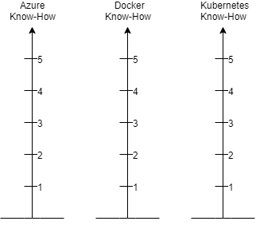

# Introduction

## Intro
- Introduction from presenters
- Introduction from participants (Name, Position, How long)
- Message from the future (What do you expect from the WS) 
    (only one statement, the most important one)

### Self Assessment
- during introduction let the participants mark their knowledge about the topics Azure, K8s and docker
    (just gut-feeling, no explanations)
