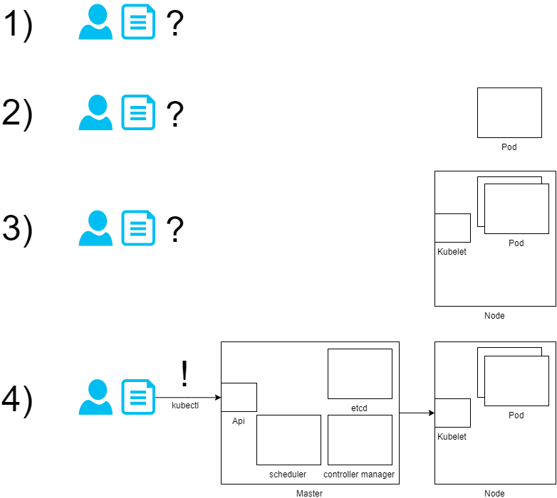

# architectual overview 

## 1) docker files / docker-compose files
Docker is about running applications without containing a whole OS.
Docker compose to handle more images and the relationship between them but all the things like configuration, access, linking between containers and metrics you need to take care of.
BUT docker compose files are a good starting point for migration.
You want to run it somewhere to take advantages of scalability, health checks/ monitoring and service discovery.
Push your images to a docker registry. Azure container registry, docker hub or private registry.
(You will need docker registry secret [https://medium.com/@pjbgf/azure-kubernetes-service-aks-pulling-private-container-images-from-azure-container-registry-acr-9c3e0a0a13f2])
(To get fast results use one from docker hub)

## 2) therefore pods are made
What is a Pod?
    - unique IP address
    - namespace
	- containers/image(-s)
	- resources/limits
    - liveness probe: live or dead, needs to be restarted
    - readiness probe: can handle traffic or not
    - nodeSelector (ah - what is a node?)

## 3) where are the Pod running
On worker nodes. These are like VM´s. 
	- can contain multiple Pod´s
	- kubelet
    - kube proxy (out of scope for basic workshop)
A node has kubelet service which handles the pod. (create container and take care of liveness and readiness)

## 4) but how communicate with it? 
Use the api of the master node. [https://kubernetes.io/docs/concepts/overview/components/]
This node has an api for communication. 
etcd is the internal storage (key-value) which stores all configurations.
A scheduler handles and assign Pod´s without nodes.
A controller manager for different activities like nodes are down or taking care of Pod replicas.
