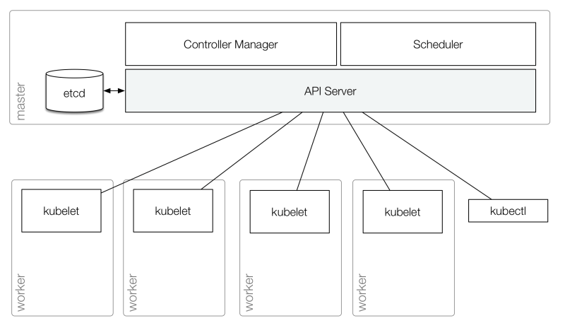
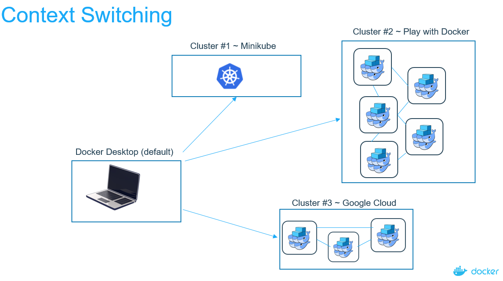

SET ENV Varaible from Cloud Shell : export $(cat config.env | sed -e /^$/d -e /^#/d | xargs)

## INTRODUCTION TO KUBECTL

* kubectl is the only tool we'll need to talk to K8s
* Rich CLI tool around the K8s API
* Everything you can do with kubectl, you can do directly with the API
* Kubectl looks for a kubeconfig file ~/.kube/config which holds
    * Information where the API is
    * Auth information like TLS Certificate or a token

 

## HANDS ON

### CONTEXT SWITCHING

If you run multiple clusters you will need to choose which cluster kubectl talks to. You can set a default cluster for kubectl by 
setting the current context in kubeconfig file. Additionally you can run the commands against a cluster using the `--cluster` flag.

* View kubeconfig file `kubectl config view`
* Switch context `kubectl config use-context`

When on cloud to set up the context use the following:
1. `az login`
2. `az aks get-credentials -n xxx --resource-group xxx` 

 

### KUBECTL

* Look at the nodes of our cluster: `kubectl get node`
* The get command can output JSON, YAML or be directly formatted: `kubectl get nodes -o yaml` `kubectl get nodes -o json`
* Getting more info: `kubectl get nodes -o wide`

## IMPERATIVE VS DECLARATIVE

Kubectl gives us different modes for managing objects:

* Imperative commands - all operations are done on live objects
    * `create`, `run`, `expose`
    * `attach`, `exec`
    * `scale`, `annotate`, `label`, `edit`, `patch`, `delete`
    * `get`, `describe`, `logs`
* Imperative with config files
* Declarative 
    * `apply`

Imperative systems:

* simpler
* if a task is interrupted we have to restart 
* lack of review process for actions done on the cluster
* lack of source of truth what should be running

Declarative systems:

* if a task is interrupted we can figure out whats missing and do only what's necessary (incremental update)

### Lets create a pod (Imperatively) ...

1. Run pod: `kubectl run --image=nginx nginx-app --port=80`
2. List pods: `kubectl get pods`
3. Forward local port to pod port: `kubectl port-forward xxxPodNamexxx 8080:80`
4. Test it with curl from a new shell instance: `curl localhost:8080`
5. Show me the logs of the pod: `kubectl logs xxxPodNamexxx`
6. Delete the resources `kubectl delete deployment nginx-app`
