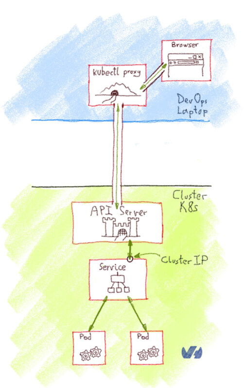
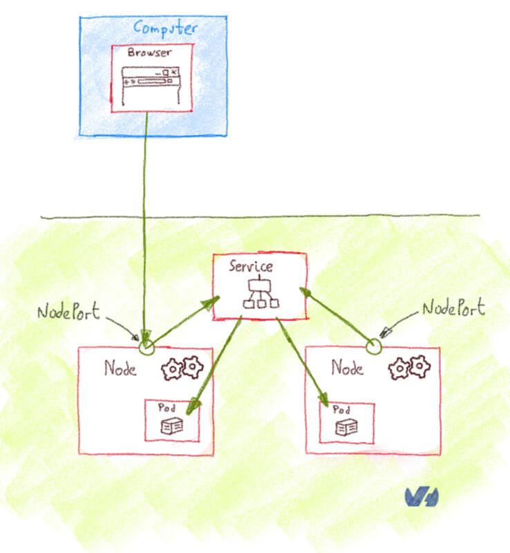
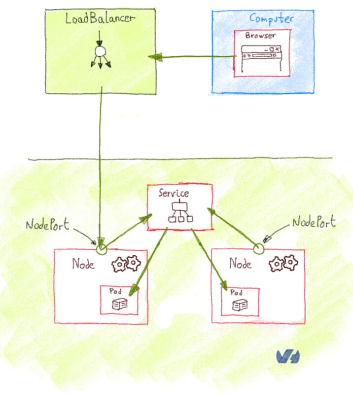

# Basic Concepts

[_Back to overview_](README.md)

## Kubernetes Core Concepts

### Kubernetes Objects

#### Pod

* Smallest execution unit of K8s
* It is just an execution environment for one or more tightly coupled containers
* Provides shared storage/network for containers in it
* Containers in Pod reach each other using `localhost`
* Each Pod gets assigned a unique IP address.

Pods are ephemeral. They are not designed to run forever. Once its terminated it cannot be brought back. They do not 'heal' nor repair itslef. Each time its recreated it gets a new identity and a new IP.

Beacuse they are ephemeral, it is not recommended to create Pods directly. Use a controller like a Deployment which creates and manages Pods for you.

Pod Status:

* Pending
* Running
* Succeeded
* Failed
* Unknown

Best practicies for Pods:

* Set Pod limits (CPU and memory)
* Keep your Pods small (best practice one container per Pod)
* Always terminate Pods in a gracefull way
* When possible and running on different node pool run Pods on nodes based on the workflow type

#### Hands on for Pods

* Lets open and analyze the file `./pod.yml`
* Lets deploy it to the cluster `kubectl apply -f pod.yml`
* List all pods `kubectl get pods`
* Lets kill it `kubectl delete pod xxxPodNamexxx`
* Lets see if it is still there `kubectl get pods`

#### Service

* A stable endpoint to connect to "something"
* When that something is a Pod it targets it by Label Selector
* Service can map an incoming port to any targetPort (default incomePort=targetPort)
* Services support TCP, UDP

Types of services:

* ClusterIP - exposes the service on a cluster internal IP. It is reachable only within cluster
* NodePort - exposes the service on each Nodes IP at a static port. Can be accessed from outside the cluster
* LoadBalancer - expose the service externally using a cloud provider loadbalancer

 
 
 
 
 

Drawing Credits @Horacio Gonzalez 
 
[More information on types of services](https://www.ovh.com/blog/getting-external-traffic-into-kubernetes-clusterip-nodeport-loadbalancer-and-ingress/)

#### Hands on Services

Lets try to open a simple web page to the world using a deployment and a service of type Loadbalancer:

* Lets open and analyze the file `./loadbalancer.yml`
* Lets deploy it to the cluster `kubectl apply -f loadbalancer.yml`
* List deployments `kubectl get deployments`
* List all pods `kubectl get pods`
* List services `kubectl get services`
* Go to azure portal and find the load balancer (get its public ip)
* In your browser paste the IP and hit enter

Lets try something else (participants create the solution):

* Use the same depployment as on the previous example
* Create a Service of type Cluster IP
* From within the cluster try to hit the service with curl (provide solution based on gained knowledge) (explain Service Discover basics)

Tips:
* Using this command you can get an interactive shell to an alpine container `kubectl run -i --tty alpine --image=alpine --restart=Never -- sh`
* Install curl on the container `apk add --no-cache curl`

#### Volume

#### Namespace

* Logical isolation of a K8s cluster
* Each object is part of one namespace (excluding Nodesand other low level resources) - use `kubectl api-resources --namespaced=false`
* A scope for unique names inside the namespace

K8s starts with three basic namespaces:

* default - the default namespace for objects with no other namespace
* kube-system - holds objects created by the Kubernetes system
* kube-public - created automatically and is readable by all users

Example usage of namespaces splitting the cluster

* Different environment (we prefer to have physicall isolation between env)
* Different teams (with ResourceQuota constraints)
* Partitioning customers in a multitenancy scenario

Some useful commands when dealing with namespaces:

- Set default context for kubectl: `kubectl config set-context --current --namespace=xxNamespacexx`
- List all namespaces: `kubectl get namespaces`

#### Hands on for Pods

* Lets open and analyze the file `./namespace-demo.yml`
* Lets deploy it to the cluster `kubectl apply -f namespace-demo.yml`
* List all pods in namespace `kubectl get pods --namespace=demo-ns`
* Lets clear the resources `kubectl delete namespace demo-ns`

### Controller Objects

#### ReplicaSet
#### Deployment

Why Pod replication?

* Reliability
* Load balancing
* Scaling

A brief history?

Replication Controller is the original form of replication in
K8s. It is a structure that enables you to easily create multiple pods, then make sure that that number of pods always exists. 

Replica Sets are same as replication controller the only difference lies that a replica set supports set-based selector whreas a RC only supports equality based selector requirements.

Equality-based selector: `environment = production; tier != frontend`

Set-based requirement: `environment in (production, qa); !partition`

Deployments

* Manages a set of Pods (replicas)
* Self healing capability
* Scale up/down capability

 

Best practicies Deployments

* Use only for stateless services

#### Hands on Deployments 

* Lets open and analyze the file `./deployment.yml`
* Lets deploy it to the cluster `kubectl apply -f deployment.yml`
* List all pods `kubectl get pods`
* Lets kill it `kubectl delete pod xxxPodNamexxx`
* Lets see the self healing capability `kubectl get pods`
* Clear the resources `kubectl delete deployment web`

#### StatefulSet
#### DeamonSet
#### Job

### Control Plane

- Nodes

See this [overview page](https://kubernetes.io/docs/concepts/) for more details.
