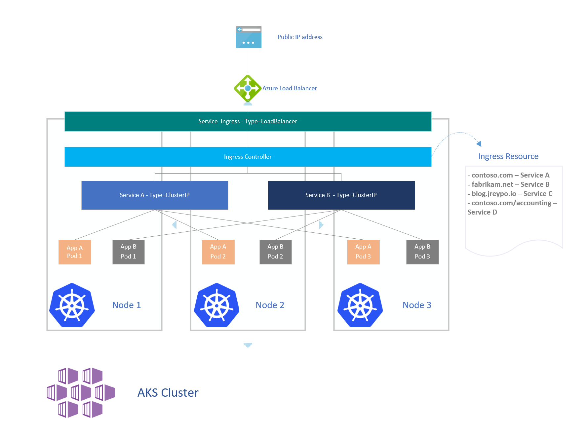

# Ingres basics
[_Back to overview_](README.md)

Ingress is a resource to add rules for routing traffic from external world to the services in the K8s cluster.

With ingress there are always two components involved:

* Kubernetes Ingress
* Kuberentes Ingress Controller

Ingress is a native K8s resource which defines rules to route traffic from outside world to the inside of the cluster. It requires an ingress controller for routing the rules specified in the ingress object.

An Ingress controller is a service deployed in the cluster (nothing more than a deployment exposed to a service).

The most widely used Ingress Controller is Nginx Ingress Controller.

 