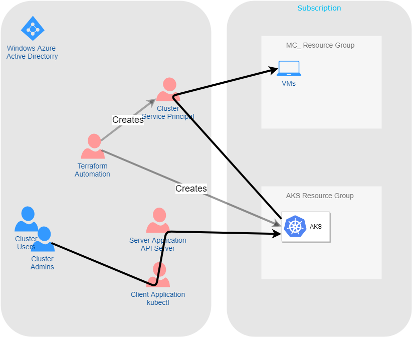

# Basic Concepts

[_Back to overview_](README.md)

## Role Based Access Control

Azure is tightly coupled to Azure Active Directory (AAD), which can be used to mange users, groups, roles etc.
This huge user-mangement system can be integrated into kubernetes, so that you can use your Active Directory Principals as Technical Users within Kubernetes and assign them privledges based on namespace, resource-types or based on other metrics.

### Azure AAD Integration

The security of AKS clusters can be enhanced with the integration of AAD.


### Creating the Server and Client Applications

The script below automates the creation and the consenting of the server and client applications used for the AAD integration.

```bash
#!/bin/sh
aksname="<name of the cluster>"

# ============
# Server
# ============

serverApplicationId=$(az ad app create \
    --display-name "${aksname}Server" \
    --identifier-uris "https://${aksname}Server" \
    --query appId -o tsv)

az ad app update --id $serverApplicationId --set groupMembershipClaims=All
az ad sp create --id $serverApplicationId

serverApplicationSecret=$(az ad sp credential reset \
    --name $serverApplicationId \
    --credential-description "AKSPassword" \
    --query password -o tsv)

az ad app permission add \
    --id $serverApplicationId \
    --api 00000003-0000-0000-c000-000000000000 \
    --api-permissions e1fe6dd8-ba31-4d61-89e7-88639da4683d=Scope 06da0dbc-49e2-44d2-8312-53f166ab848a=Scope 7ab1d382-f21e-4acd-a863-ba3e13f7da61=Role

az ad app permission grant --id $serverApplicationId --api 00000003-0000-0000-c000-000000000000
az ad app permission admin-consent --id  $serverApplicationId

# ============
# Client
# ============

clientApplicationId=$(az ad app create \
    --display-name "${aksname}Client" \
    --native-app \
    --reply-urls "https://${aksname}Client" \
    --query appId -o tsv)

az ad sp create --id $clientApplicationId

oAuthPermissionId=$(az ad app show --id $serverApplicationId --query "oauth2Permissions[0].id" -o tsv)

az ad app permission add --id $clientApplicationId --api $serverApplicationId --api-permissions $oAuthPermissionId=Scope
az ad app permission grant --id $clientApplicationId --api $serverApplicationId
```
## The users and principals

The diagram below shows how all the users and principals play together.


## Read further

This [tutorial](https://docs.microsoft.com/de-de/azure/aks/azure-ad-rbac) explains how RBAC with kubernetes actually works.

https://docs.microsoft.com/de-de/azure/aks/operator-best-practices-identity#use-azure-active-directory

https://docs.microsoft.com/de-de/azure/aks/azure-ad-integration
