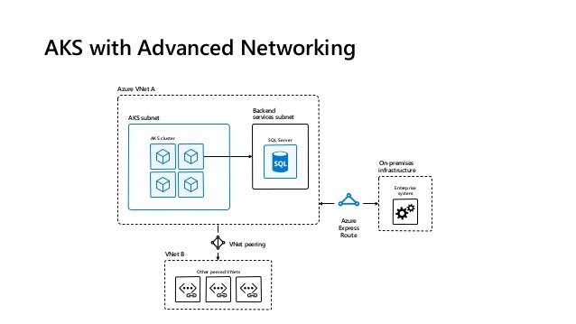

# Networking

[_Back to overview_](README.md)

## Custom VNET



### Address Ranges and Sizes:

see: https://docs.microsoft.com/de-de/azure/aks/configure-azure-cni

### Implementation

see Terraform:

```
resource "azurerm_virtual_network" "main_vnet" {
  name                              = "${local.vnet_name}"
  address_space                     = ["10.0.0.0/16"]
  resource_group_name               = "${local.resource_group_name}"
  location                          = "${var.long_region}"

  tags {
    Environment = "${var.env_tag}"
  }
}

resource "azurerm_subnet" "cluster_subnet" {
  name                              = "cluster-subnet"
  resource_group_name               = "${local.resource_group_name}"
  address_prefix                    = "10.0.0.0/20"  # 10.0.0.0 - 10.0.15.255
  virtual_network_name              = "${azurerm_virtual_network.main_vnet.name}"
}

resource "azurerm_subnet" "appgw_subnet" {
  name                              = "appgw-subnet"
  resource_group_name               = "${local.resource_group_name}"
  address_prefix                    = "10.0.17.0/24" # 10.0.17.0 - 10.0.17.255
  virtual_network_name              = "${azurerm_virtual_network.main_vnet.name}"
}
```
