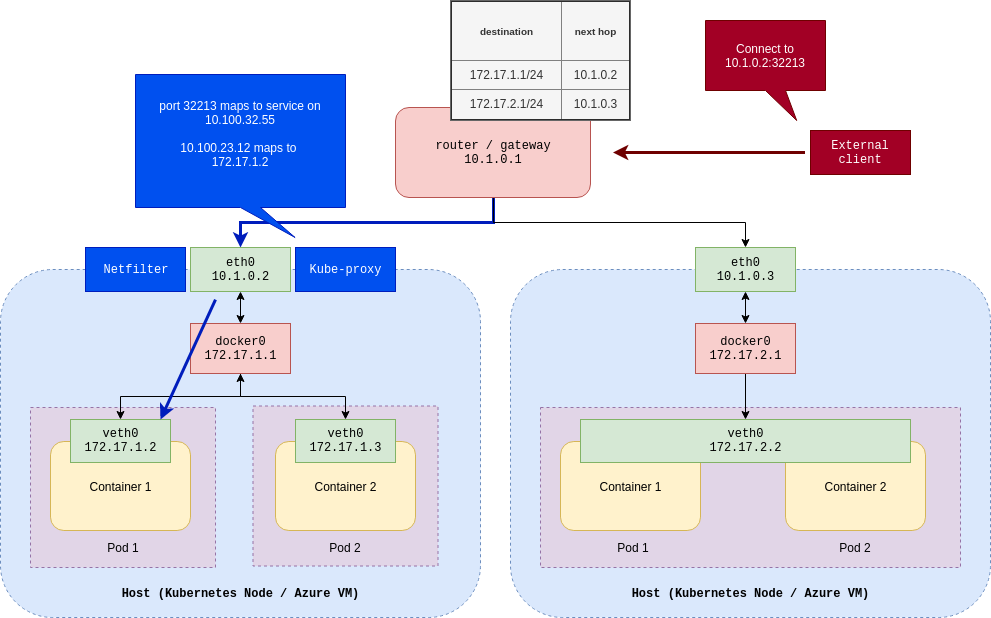

# Networking

[_Back to overview_](README.md)

## Kubernetes Networking

#### 01 - Single pod (with one container) running on a node

#### 02 - Topology with multiple pods or containers

#### 03 - Multiple nodes

#### 04 - Multiple nodes with routing (AKS basic networking)

This routing topology is the default one which is supported with Kubernetes out of the box, without any external networking plugins. Internal plugin for this network is called **Kubenet**. Azure AKS also calls this topology **"basic networking"**.

However, AKS offers another option with a plugin called **Azure CNI**, which is often referenced as **"advanced networking"**

#### 05 - AKS advanced networking with Azure CNI

#### 06 - Comparison of basic / advanced networking approaches

Here is a quick summary of pros and cons of both approaches:

Both approaches support custom VNets and defining custom CIDR ranges (kubenet with custom VNet cannot be defined through the Azure Portal!).

**Basic Networking Mode**

- Nodes and Pods are placed on different IP subnets
- User defined routing and IP forwarding is for connectivity between Pods across Nodes

Pros
  - Simple default AKS option
  - less IP addresses required
Cons
  - Performance impact
  - Peering or On-Premise connectivity is hard(er) to archieve
  - basic networking features only

**Advanced Networking Mode**

- Nodes and Pods are placed on same IP subnet
- no routing table
- CNI is a vendor-neutral protocol, used by container runtimtes to make requests to Network Providers

Pros
  - Better Performance with traffic outside of the cluster
  - Single IP CIDR to manage
  - Peering and On-Premise connectivitiy is out of the box
  - advanced features like virtual nodes or network policies

#### 07 - Services

Let's take a look at ClusterIP service type first:

Kube proxy has three modes of running:
- Userspace
- iptables
- IPVS

Node Port variation looks like this:

Additionally, Load balancer could be added:

### References
- https://supergiant.io/blog/understanding-kubernetes-kube-proxy/
- https://docs.microsoft.com/en-us/azure/aks/configure-kubenet
- https://docs.microsoft.com/en-us/azure/aks/configure-azure-cni
- https://docs.microsoft.com/en-us/azure/aks/concepts-network

