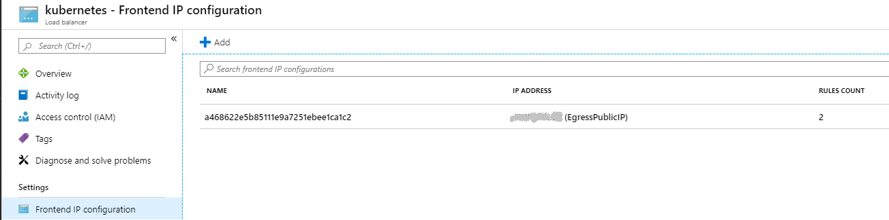

# Networking

[_Back to overview_](README.md)

## Egress

For Traffic from the cluster to other systems, we often need to setup a whitelist firewall-rule, to ensure the clusters ip address is allowed to get access to those systems. Therefore a static egress ip-address is required.
Usually the egress ip that will be visible to the outside is the first IP address that is listed in the frontend IP configuration of your azure load balancer.

This is usually a dynamic ip, but one can also setup a static ip like so:

https://docs.microsoft.com/en-us/azure/aks/static-ip

Or by executing this script (Windows CMD):

```bat
@echo off

rem =========================================
rem Variables
rem =========================================

set CLUSTER_RESOURCE_GROUP=<FILL OUT>
set CLUSTER_NAME=<FILL OUT>
set TEMPFILE_RESOURCE_GROUP=resource-group.txt
set TEMPFILE_IP_ADDRESS=ip-address.txt
set TEMPFILE_K8S_SERVICE=k8s-service.yaml

rem =========================================
rem Startup
rem =========================================

echo Creating a static ip-address in k8s azure resource group and egress service
echo Ready to start
pause

rem =========================================
rem Main
rem =========================================

echo Creating Public IP for egress traffic ...
set IP_ADDRESS_NAME=EgressPublicIP
call az aks show --resource-group %CLUSTER_RESOURCE_GROUP% --name %CLUSTER_NAME% --query nodeResourceGroup -o tsv > %TEMPFILE_RESOURCE_GROUP%
set /p RESOURCE_GROUP=<%TEMPFILE_RESOURCE_GROUP%
echo Creating in Azure: Public ip: %IP_ADDRESS_NAME% in resource group: %RESOURCE_GROUP%
call az network public-ip create --resource-group %RESOURCE_GROUP% --name %IP_ADDRESS_NAME% --allocation-method static >nul
echo Your IP is:
call az network public-ip list --resource-group %RESOURCE_GROUP% --query [0].ipAddress --output tsv > %TEMPFILE_IP_ADDRESS%
set /p IP_ADDRESS=<%TEMPFILE_IP_ADDRESS%
echo %IP_ADDRESS%

(
echo apiVersion: v1
echo kind: Service
echo metadata:
echo   name: azure-egress
echo spec:
echo   loadBalancerIP: %IP_ADDRESS%
echo   type: LoadBalancer
echo   ports:
echo   - port: 80
)>"%TEMPFILE_K8S_SERVICE%"

call kubectl apply -f %TEMPFILE_K8S_SERVICE%
echo Successfully created static ip and egress service

rem =========================================
rem Cleanup
rem =========================================

echo cleaning up...
del %TEMPFILE_RESOURCE_GROUP%
del %TEMPFILE_IP_ADDRESS%
del %TEMPFILE_K8S_SERVICE%

echo Ready to quit
pause
```

### Hint

If you previously setup an ingress controller or any other public service, the first ip-address in the azure load-balancer will already be allocated, so you have to remove those services first and ensure that the egress service will allocate the first slot in the load-balancer.


