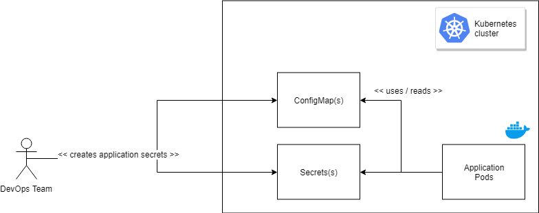

# Application Configuration
## Preparation

When creating Kubernetes Resources with terraform ([See also](../04-infrastructure-deployment/README.md)), then you have to assign every member to the group, which will be granted to work with the aks.

## Configuration via application deployment


## Configuration via Config Maps and Secrets



A good [Stackoverflow](https://stackoverflow.com/questions/33478555/kubernetes-equivalent-of-env-file-in-docker) article about configuring pods.

- Create a ConfigMap resource from YAML

```bash
kubectl apply -f env-configmap.yaml
```

- Create a Secret resource from YAML --> fail because not base64 encoded

```bash
kubectl apply -f env-secret.yaml

Error from server (BadRequest): error when creating "env-secret.yaml": Secret in version "v1" cannot be handled as a Secret: v1.Secret.ObjectMeta: v1.ObjectMeta.TypeMeta: Kind: Data: decode base64: illegal base64 data at input byte 3, error found in #10 byte of ...|nv secret"},"kind":"|..., bigger context ...|:"v1","data":{"SINGLE_ENV_SECRET_KEY":"env secret"},"kind":"Secret","metadata":{"annotations":{"kube|...
```

- Create the secret with kubectl and examine how the yaml should have looked like

```bash
kubectl create secret generic env-secret --from-literal=SINGLE_ENV_SECRET_KEY="env secret" -o yaml
```

- Create the ConfigMap containing a file

```bash
kubectl apply -f file-configmap.yaml
```

- Create the pod with ConfigMap and Secret references

```bash
kubectl apply -f nginx-configmaps-and-secrets.yaml
```

- Check out the environmental variables and file contents

```bash
kubectl exec -it nginx-configmaps-and-secrets printenv
kubectl exec -it nginx-configmaps-and-secrets cat /filemount/file.text
```
