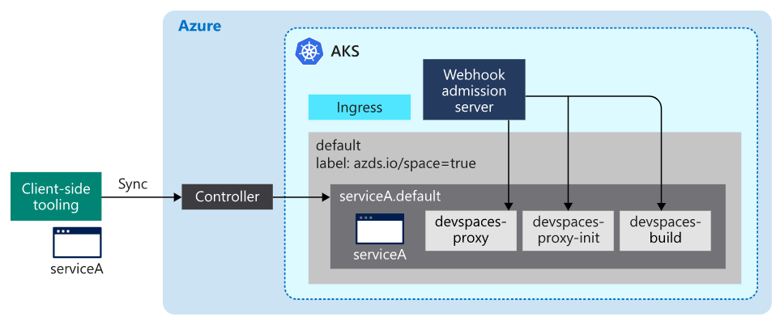
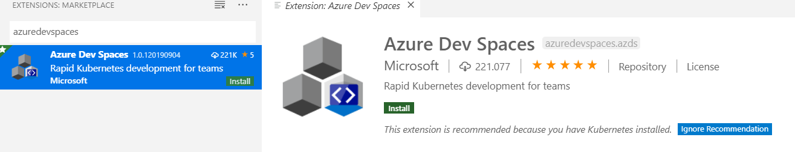
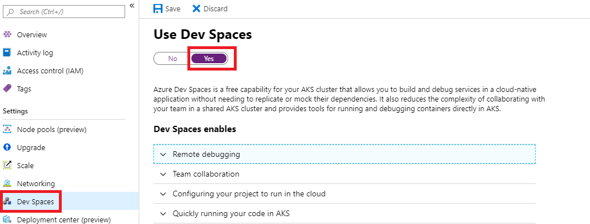
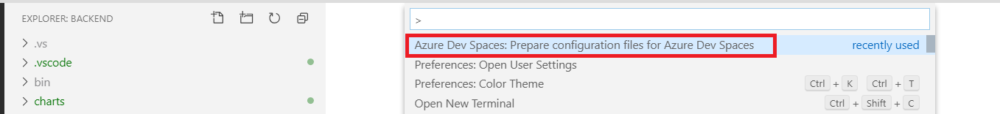

# Additional Tools

[_Back to overview_](README.md)

## Debugging with Azure Dev Spaces

For live debugging your Kubernetes app, Azure provides Azure Dev Spaces, which installs a additional controller into your cluster and integrates smoothly into the current IDEs.



### Example with VSCode

1. Install the VSCode Extension (C# + Azure Dev Spaces)



2. Enable Azure Dev Spaces Feature in your cluster via Azure Portal or Azure CLI



```bash
azds use -g <resource-group> -n <cluster-name>
```

3. Install Azure Dev Spaces CLI on your client OS

https://docs.microsoft.com/en-us/azure/dev-spaces/troubleshooting#error-required-tools-to-build-and-debug-projectname-are-out-of-date

4. Prepare the appliaction



5. Remove Azure Dev Spaces

```bash
azds remove -g <resource-group> -n <cluster-name>
```

### Usage Discussion

Beside the easy debugging integration, Azure Dev Spaces also provides you the ability to collaborate in multiple teams. This won't be further explained here, but you can read more about this topic in the [official Microsoft Documentation](https://docs.microsoft.com/en-us/azure/dev-spaces/quickstart-team-development).

**Attention:**
Using Azure Dev Spaces in a production environment should be done with care and before doing it, you should understand most of the details, to not bypass any security mechanisms and create other problems that might not be obvious (like adding of the instrumentation containers on the nodes with **root access**).

### References

Debugging: https://docs.microsoft.com/en-us/azure/dev-spaces/quickstart-java
Team-Development: https://docs.microsoft.com/en-us/azure/dev-spaces/quickstart-team-development
