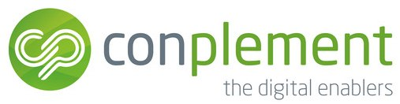

# Azure Kubernetes Workshop

`azure-kubernetes-workshop` is a workshop documentation with hands-on exercises for people already working with Kubernetes. Throughout the workshop a main Docker container will be used which is to be built and started in an interactive mode.

---

## DAY 1

#### Part 1: 10:00 - 11:00

[Introduction](01-introduction/README.md)

- [Introduction of conplement AG](https://www.conplement.de)
- [Introduction of participants](01-introduction/01-questions.md)
- [Check Prerequisites](01-introduction/02-prerequisites.md)
- Align Agenda towards participants requirements
- Introduction to this github repository
- [Setup Tooling for every participant (docker, azure, cli)](02-getting-started/README.md)
- Decide Team lineup for example work

:coffee: break

#### Part 2: 11:15 - 12:15

[Basic Concepts](03-basic-concepts/README.md)

- [Refreshing Kubernetes Core Concepts](03-basic-concepts/01-kubernetes-core-concepts.md)
- [Azure and Kubernertes RBAC](03-basic-concepts/02-azure-kubernetes-rbac.md)
- [Kubernetes System Components](03-basic-concepts/03-system-components.md)
- [AKS Subtleties](03-basic-concepts/04-aks-subtleties.md)

Operations

- [Infrastructure Operations vs. Application Operations](03-basic-concepts/05-infrastructure-vs-app-ops.md)
- [Infrastructure Operations](03-basic-concepts/06-infrastructure-ops.md)
- [Disaster Recovery](03-basic-concepts/07-disaster-recovery.md)
- [Operations Best Practices](03-basic-concepts/08-ops-best-practices.md)

Infrastructure Deployment

- [Infrastructure Deployment with Terraform](04-infrastructure-deployment/README.md) (**Hands On**)

:hamburger: :pizza: lunch

#### Part 3: _13:15 - 14:45_

[Application deployment](05-application-deployment/README.md)

- [Deployment with kubectl](05-application-deployment/01-kubectl-apply.md)
- [Helm Basics](05-application-deployment/02-helm-basics.md) **(Hands-On)**
- [Helm Example](05-application-deployment/03-helm-example.md)
- [Helm 3 Preview](05-application-deployment/04-helm3-preview.md)
- [Introduction to CNAB](05-application-deployment/05-cnab.md)

:coffee: break

#### Part 4: _15:00 - 16:45_

[Scheduling](06-scheduling/README.md) **(Hands-On)**

- [Scheduling internals](06-scheduling/01-scheduling-internals.md)
- [Self-healing mechanisms](06-scheduling/02-self-healing.md)
- [Health checks](06-scheduling/03-health-checks.md)
- [Resource Management](06-scheduling/04-resource-management.md)
- [Resource quotas](06-scheduling/05-resource-quotas.md)

---

## DAY 2

#### Part 1: _09:00 - 10:15_

Recap of DAY 1

[Application Configuration](07-application-configuration/README.md) **(Hands-On)**

- [Application Configuration with Config Maps and Secrets](07-application-configuration/01-application-configuration-builtin.md)
- [Application Configuration with Terraform](07-application-configuration/02-application-configuration-terraform.md)
- [Key Rotation](07-application-configuration/03-key-rotation.md)
- [Azure Key Vault](07-application-configuration/04-configuration-via-keyvault.md)
- [Pod Identity](07-application-configuration/05-pod-identity.md)
- [Azure Key Vault with Pod Identity](07-application-configuration/06-keyvault-with-podidentity.md)

:coffee: break

#### Part 2: _10:30 - 12:00_

[Service Discovery](08-service-discovery/README.md) **(Hands-On)**

- [DNS & Kubernetes Labels](08-service-discovery/README.md)
- [Load balancing and access from outside the cluster](08-service-discovery/README.md)

:hamburger: :pizza: lunch

#### Part 3: _13:00 - 14:30_

[Networking](09-networking/README.md)

- [Networking Basics](09-networking/01-networking-basics.md)
- [Kubernetes and AKS Networking](09-networking/02-kubernetes-and-aks-networking.md)
- [Network Policies](09-networking/03-network-policies.md)

:coffee: break

#### Part 4: _14:45 - 16:45_

[Advanced Networking](10-advanced-networking/README.md)

- [Ingress](10-advanced-networking/01-ingress.md) (**Hands-On**)
- [Egress](10-advanced-networking/02-egress.md)
- [Session Affinity](10-advanced-networking/03-session-affinity.md)

---

## DAY 3

#### Part 1: _09:00 - 10:15_

Recap of Day 2

[Additional Tools](11-additional-tools/README.md)

- [Debugging with Azure Dev Spaces](11-additional-tools/01-debugging.md)
- [Shell](11-additional-tools/02-cmd-pimping.md)
- [Kubectl Plugins](11-additional-tools/03-kubectl-plugins.md)
- UI Tools (Builtin Dashboard)

:coffee: break

#### Part 2: _10:30 - 12:00_

[Scaling](12-autoscaling/README.md)

- [Node Autoscaling](12-autoscaling/01-node-autoscaling.md) (**Hands-On**)
- [Virtual Nodes](12-autoscaling/02-virtual-node-scaling.md)
- [Pod Autoscaling](12-autoscaling/03-pod-autoscaling.md) (**Hands-On**)
- [Custom Metric Autoscaling](12-autoscaling/04-custom-metric-scaling/custom-metric-autoscaling.md)
- [Node Pools](12-autoscaling/05-node-pools.md)

:hamburger: :pizza: lunch

#### Part 3: _13:00 - 14:00_

[Update strategies](13-update-strategies/README.md)

- [Recreate Strategy](13-update-strategies/01-recreate.md)
- [Ramped Deployment](13-update-strategies/02-ramped.md)
- [Blue Green Deployment](13-update-strategies/03-blue-green.md)
- [Canary Releases](13-update-strategies/04-canary.md)
- Discussion - what do you have in production?

:coffee: break

#### Part 4: _14:00 - 15:00_

Questions & Answers

:airplane: :taxi: :bullettrain_side:

---

## Optional Topics

:watch: :grey_question:

- Storages and Volumes
- Azure DevOps
- Monitoring with Prometheus
- Dashboards with Grafana
- Logging with ElasticSearch
