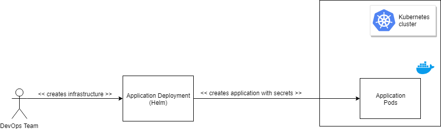
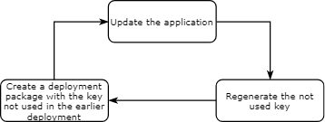

# Application Configuration

## Preparation

When creating Kubernetes Resources with terraform ([See also](../terraform/README.md)), then you have to assign every member to the group, which will be granted to work with the aks.

## Configuration via application deployment



## Configuration via Config Maps and Secrets


A good [Stackoverflow](https://stackoverflow.com/questions/33478555/kubernetes-equivalent-of-env-file-in-docker) article about configuring pods.

* Create a ConfigMap resource from YAML

```bash
kubectl apply -f env-configmap.yaml
```
* Create a Secret resource from YAML --> fail because not base64 encoded

```bash
kubectl apply -f env-secret.yaml

Error from server (BadRequest): error when creating "env-secret.yaml": Secret in version "v1" cannot be handled as a Secret: v1.Secret.ObjectMeta: v1.ObjectMeta.TypeMeta: Kind: Data: decode base64: illegal base64 data at input byte 3, error found in #10 byte of ...|nv secret"},"kind":"|..., bigger context ...|:"v1","data":{"SINGLE_ENV_SECRET_KEY":"env secret"},"kind":"Secret","metadata":{"annotations":{"kube|...
```

* Create the secret with kubectl and examine how the yaml should have looked like

```bash
kubectl create secret generic env-secret --from-literal=SINGLE_ENV_SECRET_KEY="env secret" -o yaml
```

* Create the ConfigMap containing a file

```bash
kubectl apply -f file-configmap.yaml
```

* Create the pod with ConfigMap and Secret references

```bash
kubectl apply -f nginx-configmaps-and-secrets.yaml
```

* Check out the environmental variables and file contents

```bash
kubectl exec -it nginx-configmaps-and-secrets printenv
kubectl exec -it nginx-configmaps-and-secrets cat /filemount/file.text
```

## Configuration via infrastructure creation

Some of the secrets are created during the infrastructure creation, when using Terraform and the Kubernetes provider it can look like this [example](../terraform/kubernetes.tf).


## Key Rotation



For a CICD example [See also](https://blog.kloud.com.au/2018/09/19/automatic-key-rotation-for-azure-services/)

## Configuration via Key Vaults

### Azure Key Vault

#### Using Key Vault with credentials in a Kubernetes Secret
* Install the Key Vault FlexVolume
```bash
kubectl create -f https://raw.githubusercontent.com/Azure/kubernetes-keyvault-flexvol/master/deployment/kv-flexvol-installer.yaml
```

* Create a secret containing the Service Principal Credentials to read from the Azure Key Vault

```bash
kubectl create secret generic kvcreds --from-literal clientid=$ARM_CLIENT_ID --from-literal clientsecret=$ARM_CLIENT_SECRET --type=azure/kv
```

* Create the pod with the FlexVolume referencing the Azure Key Vault

  * Edit the `nginx-flex-kv.yaml` file and replace values `"..."` with your environment's settings.
  * Optionally you could create a helm chart with `helm create nginx-flex-kv` and put the yaml file in the templates folder. The `"..."` parts can be replaced by setting the helm values.

```bash
kubectl create -f nginx-flex-kv.yaml
```

* Check out the flex volume contents

```bash
kubectl exec -it nginx-flex-kv cat /kvmnt/test-secret
```
#### Using Key Vault with Pod Identity

* Inspect the contents of the [keyvault.tf](../terraform/keyvault.tf) and the [podidentity.tf](../terraform/podidentity.tf) templates

* Run this command to create the aad-pod-identity deployment on an RBAC-enabled cluster:
  
```bash
kubectl apply -f https://raw.githubusercontent.com/Azure/aad-pod-identity/master/deploy/infra/deployment-rbac.yaml
```
* Get the identity created by the terraform template
```bash
```

* Replace the `<>` parts in the `aadpodidentity.yaml` file with the values of `id` and `clientId` gotten from the `az identity list` command and then apply identity and the binding

```bash
az identity list -g aksws-weu-$ENVTAG-rg

kubectl apply -f aadpodidentity.yaml
kubectl apply -f aadpodidentitybinding.yaml
```
* Create an example deployment with the `nginx-flex-kv-podidentity.yaml` (again replace the `"..."`s) and check out the pod and the `AzureAssignedIdentity` created based on the `AzureIdentityBinding` blueprint from the `aadpodidentitybinding.yaml`

```bash
kubectl apply -f nginx-flex-kv-podidentity.yaml

kubectl describe pod nginx-flex-kv-podid

kubectl get AzureAssignedIdentity
NAME                                         AGE
nginx-flex-kv-podid-default-aadpodidentity   20m
```

* Validate the pod can access the secret from Key Vault
```bash
kubectl exec -it nginx-flex-kv-podid cat /kvmnt/test-secret
secret-secret
```

#### Using Azure Key Vault Certificates as environmental variables

See the [description](https://mrdevops.io/introducing-azure-key-vault-to-kubernetes-931f82364354) and their [github repo](https://github.com/SparebankenVest/azure-key-vault-to-kubernetes)

#### Further reading

For more details [See also](https://github.com/Azure/kubernetes-keyvault-flexvol)


### Hashicorp Vault