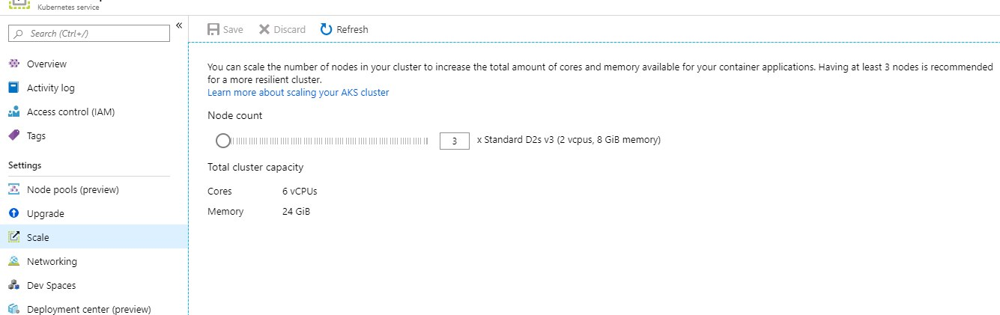
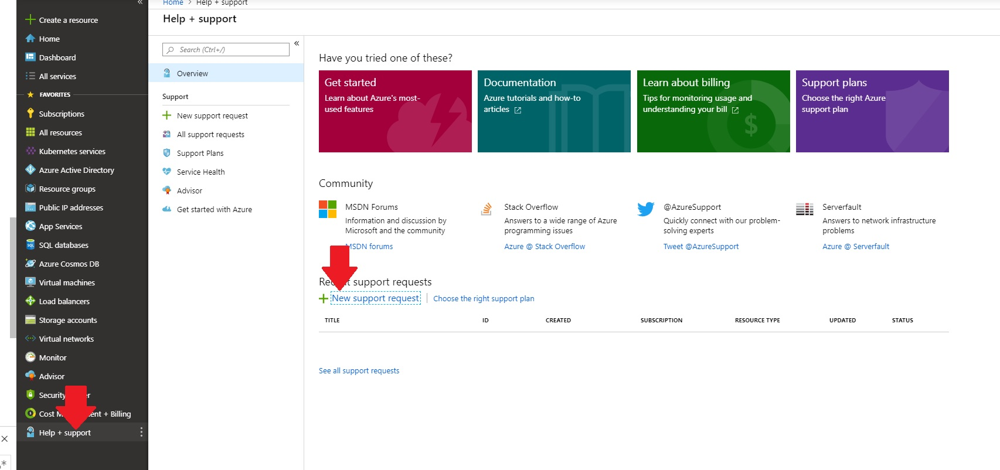

# Tips and Tricks

Here is a reference of tips and tricks round about kubernetes

#### Best Practices

- https://github.com/freach/kubernetes-security-best-practice/blob/master/README.md

#### Basic AKS Tutorials

- https://docs.microsoft.com/en-us/azure/aks/tutorial-kubernetes-prepare-app

#### Reference Architectures

- https://docs.microsoft.com/de-de/azure/architecture/reference-architectures/microservices/aks
- https://github.com/mspnp/microservices-reference-implementation
- https://docs.microsoft.com/en-us/azure/architecture/microservices/

#### CLI

- https://github.com/blendle/kns
- https://kubernetes.io/de/docs/reference/kubectl/cheatsheet/
- [kubectl proxy&](https://kubernetes.io/docs/tasks/access-kubernetes-api/http-proxy-access-api/)
- https://github.com/txn2/kubefwd

#### Migration from docker-compose to aks

- https://github.com/kubernetes/kompose

#### Security

- https://kubernetes.io/blog/2018/07/18/11-ways-not-to-get-hacked/
- https://docs.microsoft.com/de-de/azure/aks/update-credentials

#### Encryption

- https://kubernetes.io/docs/tasks/administer-cluster/encrypt-data/
- https://www.twistlock.com/labs-blog/kubernetes-secrets-encryption/
- https://itnext.io/can-kubernetes-keep-a-secret-it-all-depends-what-tool-youre-using-498e5dee9c25

#### Monitoring Overview

- https://medium.com/magalix/kubernetes-monitoring-101-core-pipeline-services-pipeline-a34cd4cc9627

#### Troubleshooting

##### Common Issues

Consider [Common Issues FAQ](https://docs.microsoft.com/en-us/azure/aks/troubleshooting).

##### Experience from Production Troubleshootings

_What to do when a Node is not ready anymore?_

- Scale up to a bigger amount of nodes, so that new Nodes get attached to the cluster
- Scale down to the former amount of nodes. The inapropreate nodes will be shut down and only proper ones should remain.



_Nodes cannot be scaled/created anymore_

- Check SKUs and Quotas of your subscription and [general AKS limitations](https://docs.microsoft.com/en-us/azure/aks/quotas-skus-regions).

_Diagnosing Connectivity Problems_

```bash
# Check if nodes are ready (check manually if all nodes are listed in the output - otherwise the API server has a problem)
kubectl get nodes -o wide
kubectl describe node <node-name>

# Check endpoints of services
kubectl get services -o wide
kubectl describe service <service-name>

# Check ingress rules (is there at least one public IP)
kubectl get ingress
kubectk describe ing <ingress-name>

# Check connectivity within cluster
kubectl run curl --image=radial/busyboxplus:curl -i --tty
nslookup <servicename>
curl <servicename>
```

See [Common Issues FAQ](https://docs.microsoft.com/en-us/azure/aks/troubleshooting) for more help.

_If nothing helped so far_

- Create a support ticket within Azure Portal and describe your issue.


